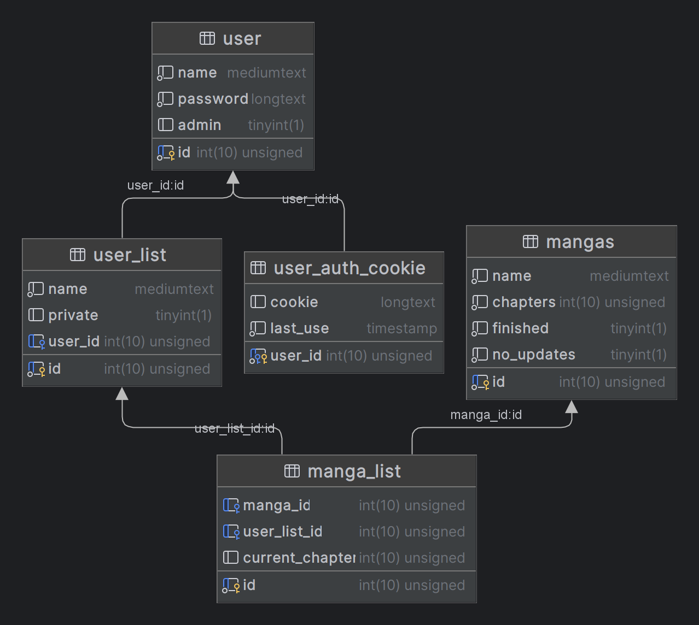

Die Datenbank besteht aus 5 Tabellen, welche alle miteinander verbunden sind.   
Der Nutzer kann auf diese jedoch nicht direkt zugreifen und muss dafür die API nutzen.
Dadurch ist jeder Zugriff auf die Datenbank limitiert.  
Um das Projekt selbst nutzen zu können, kann eine Datenbank mit der passenden Struktur über die SQL-Befehle in 
[CreateDB.txt](https://github.com/BennetLe/rust_manga_readlist_api/blob/master/CreateDB.txt) erstellt werden.

---

### Aufbau der Datenbank

