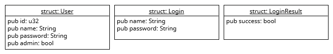
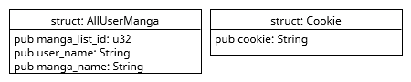
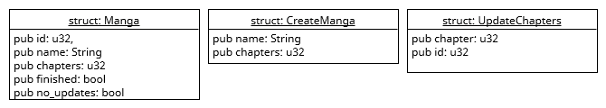
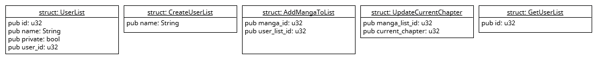

In Rust werden statt Klassen Structs verwendet. Dabei handelt es sich um Klassen die keine Methoden besitzen. Das bedeutet, dass ein Struct der Bauplan für das Speichern von Daten
ist. Deshalb habe ich für jede der Tabellen in der Datenbank und alle Rückgabewerte der API ein Struct erstellt.

??? note "Implementierung eines Struct für `user`"

    ```rust
    pub struct User {
        pub id: u32,
        pub name: String,
        pub password: String,
        pub admin: bool
    }
    ```

Bei einem Struct kann genau wie in einer Java Klasse angegeben werde ob dieser public oder nicht sein soll. Da ich für meine Structs extra Dateien angelegt habe, sind bei mir alle 
Structs und zugehörige Attribute public. Einige der von mir Implementierten structs sind sehr kurz und könnten daher auch weggelassen werden, jedoch wollte ich der Übersicht halber
für diese simplen Dinge auch Vorlagen erstellen.

---

### User

??? info "user structs"

    

--- 

### Logic

??? info "logic structs"

    

---

### Manga

??? info "manga structs"
    
    

---

### UserList

??? info "user_list structs"

    